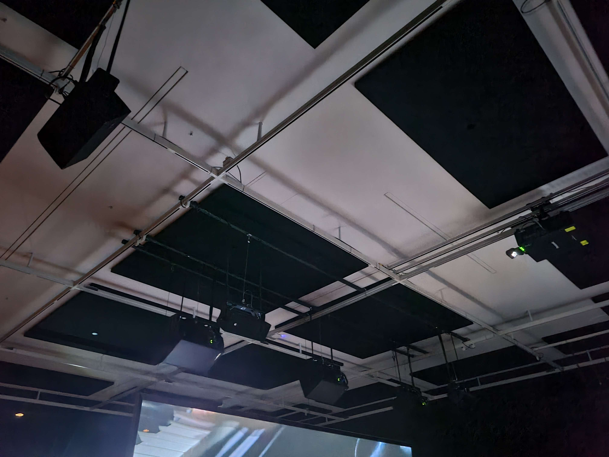
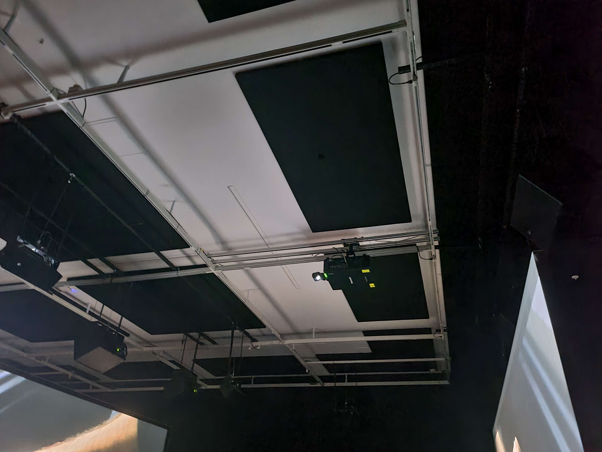

# Travail 5 : Visite au Musée des Beaux-Arts de Montréal 

Le 3 avril nous sommes allés viister une exposition au Musée des Beaux-Arts de Montréal. 

Il s'agit d'une exposition temporaire en intérieur. 

*Voici une photo du cartel décrivant l'oeuvre* 

L'oeuvre que j'ai choisi se nomme Ravel Ravel Interval. C'est une nouvre de type contemplatif Elle a été créée en 2017 par Anri Sala. 

*Voici une photo de l'ensemble de l'oeuvre*

L'œuvre se trouve dans une grande pièce sombre. Au plafond se trouvent tous les hauts-parleurs et projecteurs, au fond à droite se trouve les bancs pour que les visiteurs puissent s'asseoir et contempler l'oeuvre. Devant eux se trouvent deux énormes écrans où sont diffusées les vidéos.

L'utilisateur entre dans la grande pièce devant 2 écrans parrallèles. Il peut aller s'installer sur l'un des bancs où les 2 écrans se superposent. Les vidéos montrent deux projections des mains d'un homme qui joue du piano. La vidéo dure à peu près 20 minutes et joue en boucle ou jusqu'à ce que l'utilisateur ait envie de partir. 

*voici deux photos des projecteurs nécessaire au fonctionnement de l'oeuvre* 

Pour que cette oeuvre fonctionne bien, il est indispensable que des haut-parleurs, pour que les visiteurs puissent entendre le son, des projecteurs pour projeter les images sur les deux écrans et les écrans pour que les visiteurs puissent admirer l'eouvre. 

