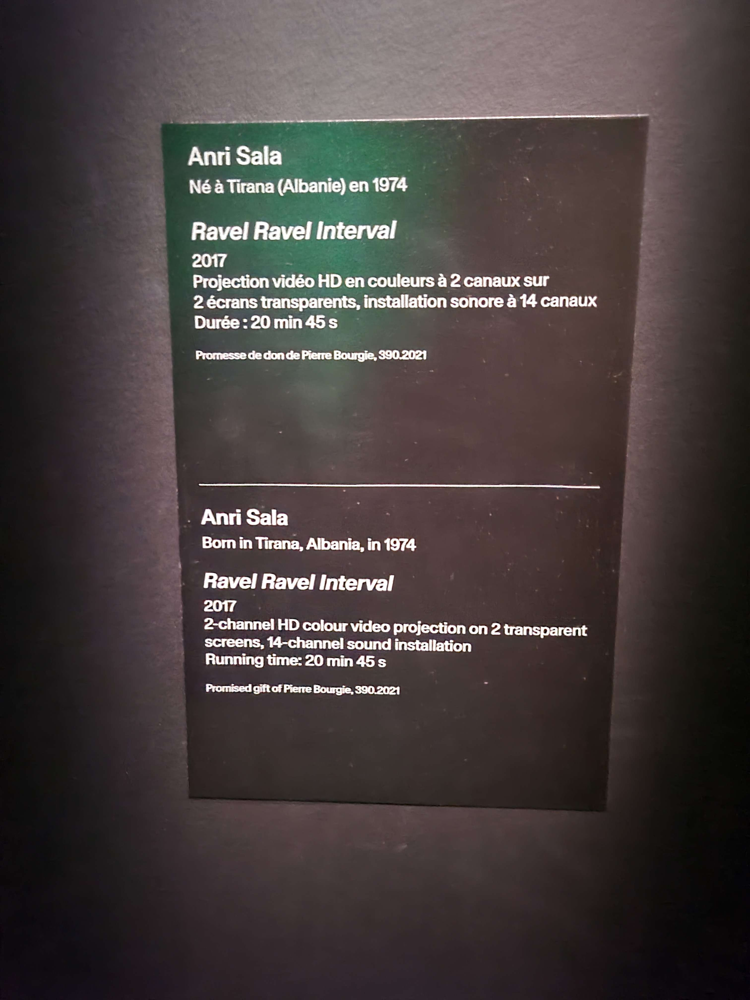
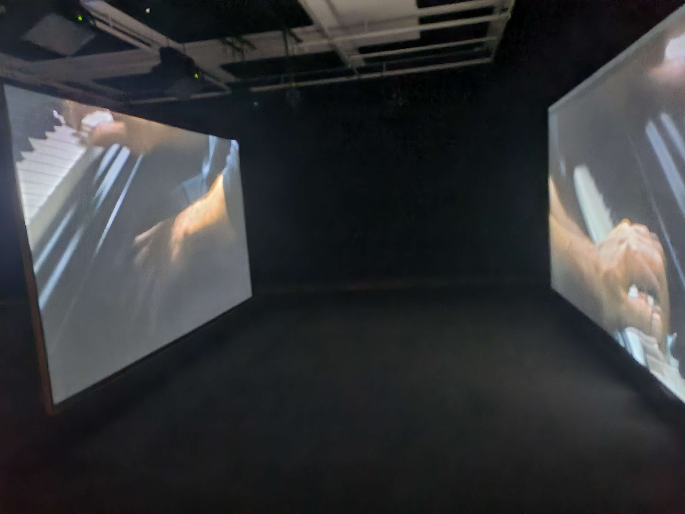

# Travail 5 : Visite au Musée des Beaux-Arts de Montréal 

Le 3 avril nous sommes allés viister une exposition au Musée des Beaux-Arts de Montréal. 

Il s'agit d'une exposition temporaire en intérieur. 

*Voici une photo du cartel décrivant l'oeuvre* 

L'oeuvre que j'ai choisi se nomme Ravel Ravel Interval. Elle a été créée en 2017 par Anri Sala. 

*Voici une photo de l'ensemble de l'oeuvre*

L'utilisateur entre dans une grande pièce devant 2 écrans parrallèles. Il peut aller s'installer sur l'un des bancs où les 2 écrans se superposent. Les vidéos montrent deux projections des mains d'un homme qui joue du piano. La vidéo dure à peu près 20 minutes et joue en boucle ou jusqu'à ce que l'utilisateur ait envie de partir. 

