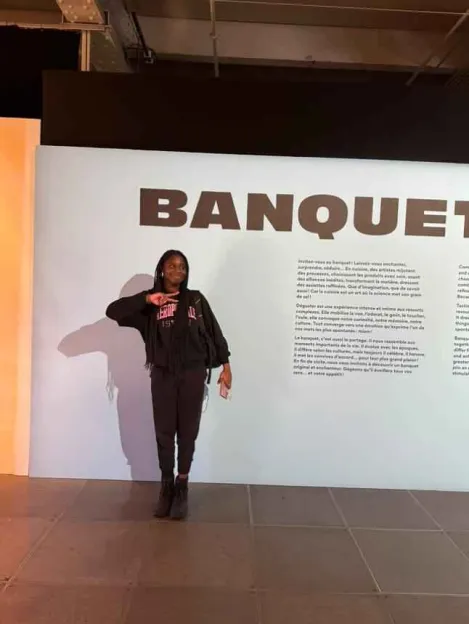
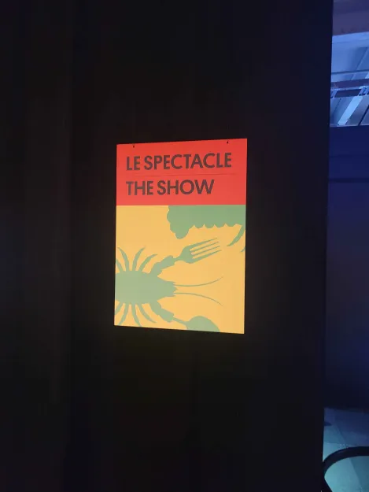
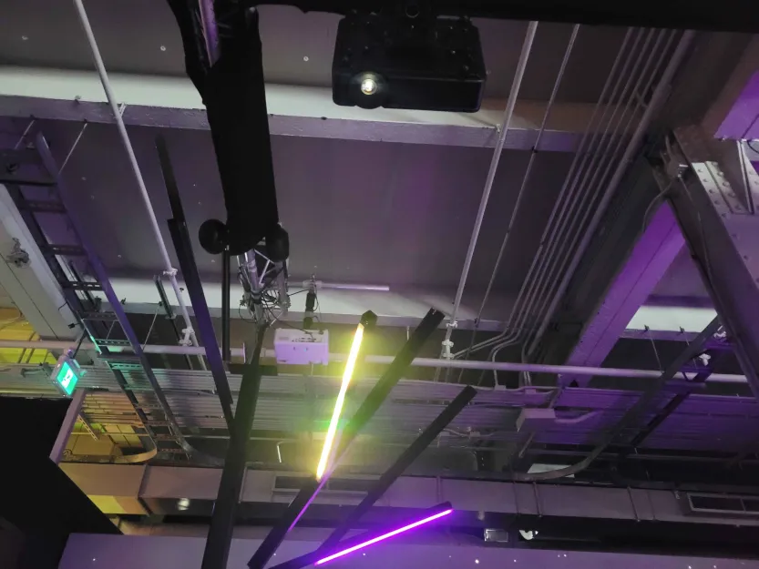
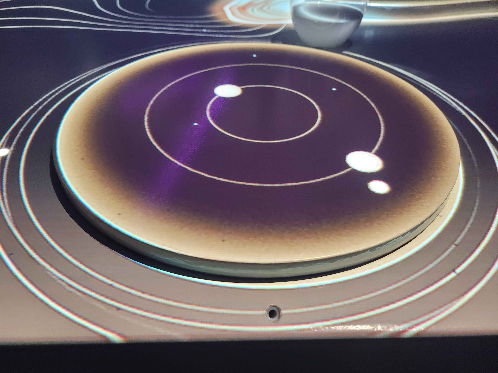

# VISITE AU CENTRE DES SCIENCES

## **L'EXPOSITION DU BANQUET**

Aujourd'hui je vais vous parler un peu de l'exposition que nous avons tous visité la semaine dernière. Le nom de l'exposition est "Banquet" et je vais vous parler plus bas, de mon oeuvre préférée un peu plus en détails. 

Tout d'abord, l'exposition s'est produite au Vieux-Montréal. Nous sommes allés la visiter le 30 Janvier. Elle a été réalisée en 2021 et il s'agit d'une exposition dite temporaire.

Voici une photo de moi devant l'entrée de l'exposition ***Banquet***

#### Le spectacle

Je vais maintenant vous parler du dispositif que j'ai préféré dans cette exposition. il s'agit de cekui intitulé "Le Spectacle". 

Voici une photo de l'affiche du dispositif *Le Spectacle*, Décembre 2024

Il s’agit d’une installation de type immersive et contemplative parce qu’on peut contempler les images défilant sur les écrans et sur la table, mais également immersive parce qu’il est possible pour nous de nous plonger dans l’Univers autour de nous puisque trois de nos sens sont mis en alerte grâce au diffuseur d’odeur et grâce au son également.

J’ai trouvé que c’était bien plus immersif et que ça pouvait être adressé à des personne plus vieilles et pas seulement des enfants. 

