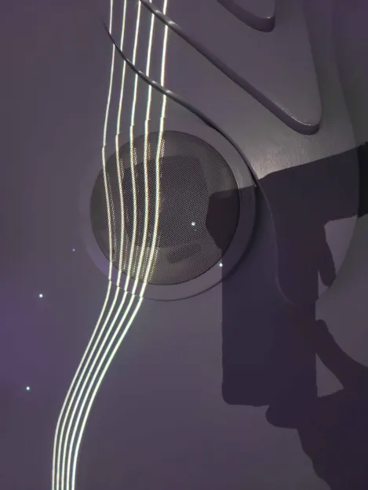

# VISITE AU CENTRE DES SCIENCES

## **L'EXPOSITION DU BANQUET**

Aujourd'hui je vais vous parler un peu de l'exposition que nous avons tous visité la semaine dernière. Le nom de l'exposition est "Banquet" et je vais vous parler plus bas, de mon oeuvre préférée un peu plus en détails. 

Tout d'abord, l'exposition s'est produite au Vieux-Montréal. Nous sommes allés la visiter le 30 Janvier. Elle a été réalisée en 2021 pas la compagnie Cité de sciences etIndustrie et il s'agit d'une exposition dite temporaire.

*Voici une photo de moi devant l'entrée de l'exposition ***Banquet****

#### Le spectacle

Je vais maintenant vous parler du dispositif que j'ai préféré dans cette exposition. il s'agit de cekui intitulé "Le Spectacle". 

*Voici une photo de l'affiche du dispositif *Le Spectacle*, Décembre 2024*

Il s’agit d’une installation de type immersive et contemplative parce qu’on peut contempler les images défilant sur les écrans et sur la table, mais également immersive parce qu’il est possible pour nous de nous plonger dans l’Univers autour de nous puisque trois de nos sens sont mis en alerte grâce au diffuseur d’odeur et grâce au son également. 

Pour assurer du bon fonctionnement du dispoditif, il faut que s'assurer avant tou du bon fonctionnement de trois éléments fondamentaux : 

- [ ] Les projecteurs
- [ ] Les diffuseurs olfactifs
- [ ] Les diffuseurs auditif

*Image du projecteur qui projettaient les images au murs et sur la table*

*Image de l'un des dispositif sonnores qui envoyaient du son tout autour de la pièce*

*Image de l'un des diffuseurs d'odeurs qui étaient présents sur la table et qui propagaient des odeurs dans toute la pièce.*

L’installation a été faite dans une salle plus ou moins grande, et la table est très large pour que plusieurs personnes puisse s’installer et profiter de l’expérience. Le bons fonctionnements des diffuseurs et des projecteurs est bien entendu le critère le plus important à l'immersion des gens profitant de l'expérience. 

J’ai trouvé que c’était bien plus immersif et que ça pouvait être adressé à des personne plus vieilles et pas seulement des enfants.

Maintenant je vais parler un peu plus de mon expérience vécue à cette exposition : Je n’ai pas spécialement apprécié l’exposition en elle-même honnêtement. Je dois avouer que les interactions présentes étaient selon moi beaucoup plus ciblées pour les enfants de bas âge ce qui a fait en sorte que ce soit beaucoup moins intéressant pour moi. Mais j’ai tout de même beaucoup aimé le dispositif que j’ai choisi, c’est-à-dire le Spectacle, avec la table et les diffuseurs olfactifs. Même avec mon grand âge j’ai trouvé ça divertissant. Mais c’est tout ce que j’ai aimé. 

Ce qui m'a le plus plu a été, comme dit plus haut, le dispositif du Spectacle parce que j’ai trouvé que c’était bien plus immersif et que ça pouvait être adressé à des personne plus vieilles et pas seulement des enfants

Pour finir, je vais maintenant parler des éléments que j'aurais changé si j'avais pu : j'aurais tout simplement mis des dispositif s'adressant à un public un peu moins jeune parce que vraiment tous les dispositifs présent au centre des sciences sont pour les enfants et sont donc assez ennuyeuse pour des gens de mon âge selon moi. Peut-être mettre une section réservée aux plus vieux ? Pour éviter que ceux-ci s'ennuient et qu'ils puissent eux aussi profiter de l'expérience. 

Voilà c'est tout ce que j'avais à dire ! 

FIN
