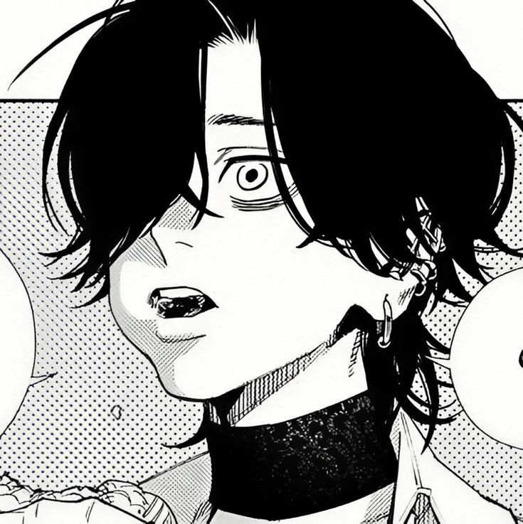
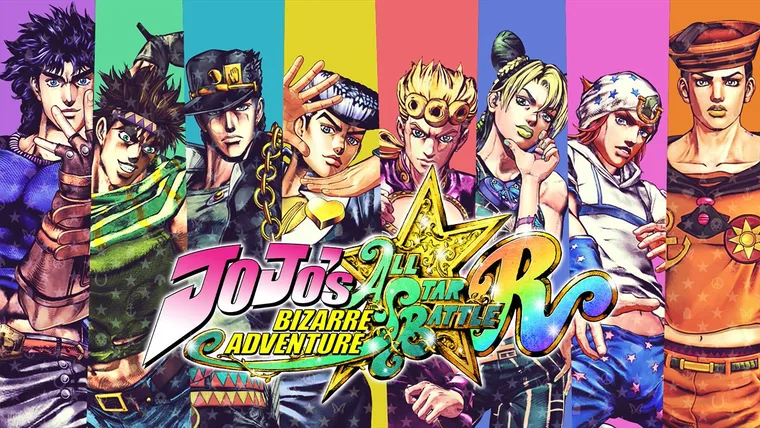
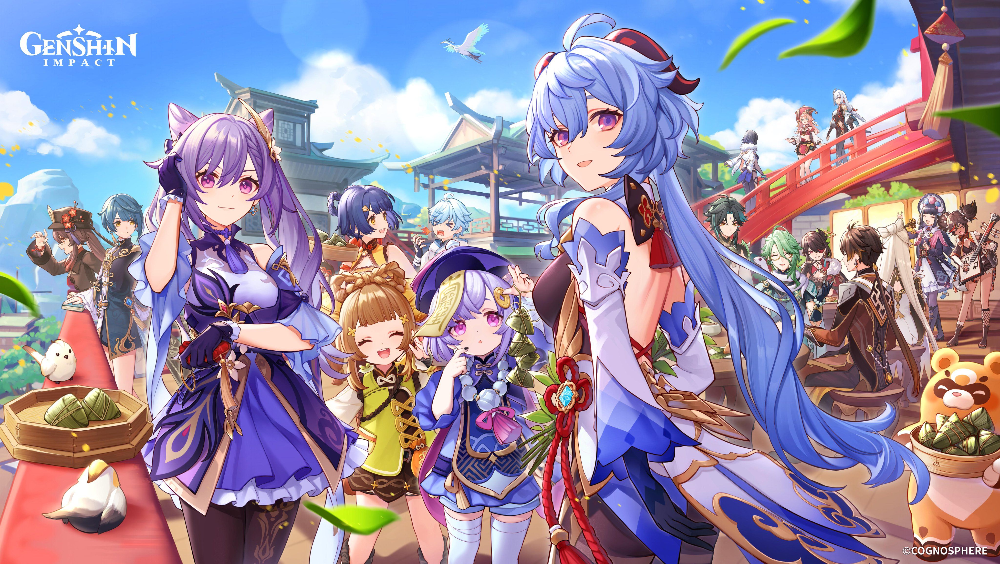

# Présentation de Kathleen

Ceci est une photo de mon personnage préféré de manga. Le manga est Gokurakugai et le personnage se surnomme Yoru.

## **Voici une présentation de mes intérêts**
J'apprécie beaucoup faire des edits/montages videos de mes personnages d'anime préféré, il s'agit là d'un hobby que j'ai depuis 2020 et que je ne lâche pas depuis. 

Vous pouvez ici observer quelques uns de mes edits que j'ai posté sur Instagram :
<https://www.instagram.com/p/DEfD8_gubtw/?img_index=2> 

Aussi comme dit plus haut j'aime beaucoup regarder toute sorte d'animes (surtout les shonen et seinen ceci dit!), j'aime bien aussi les Kdramas, les jeux vidéos, j'aime aussi écouter de la musique en résumé je suis une loser...enfin voici quelques photos de mes animes/ jeux vidéos préférés. 

## Maintenant voici qui me plait dans l'introduction à la muséologie en TIM

J'aime bien le fait de découvrir des expositions de toute sortes mais également le fait d'apprendre de nouvelles chose quant au multimédias ! Je ne pensais pas que la muse2ologie et le multimédia pouvaient être autant reliés et pourtant, oui, je suis surprise !

