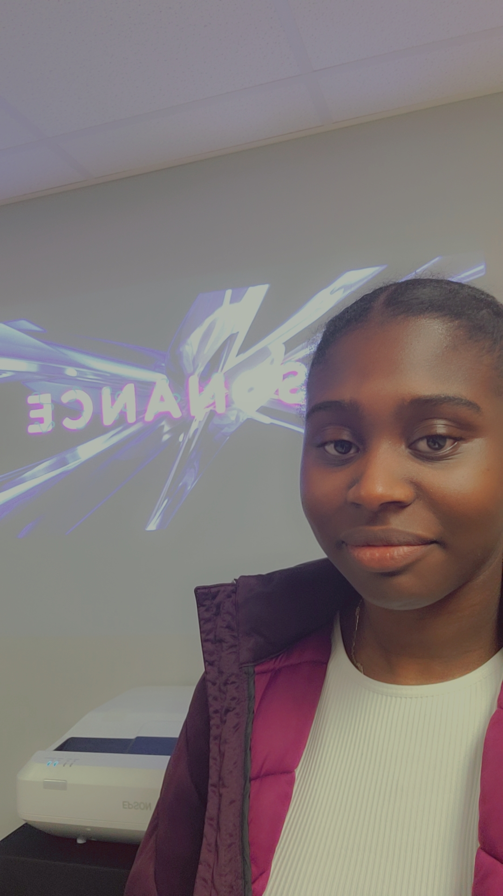
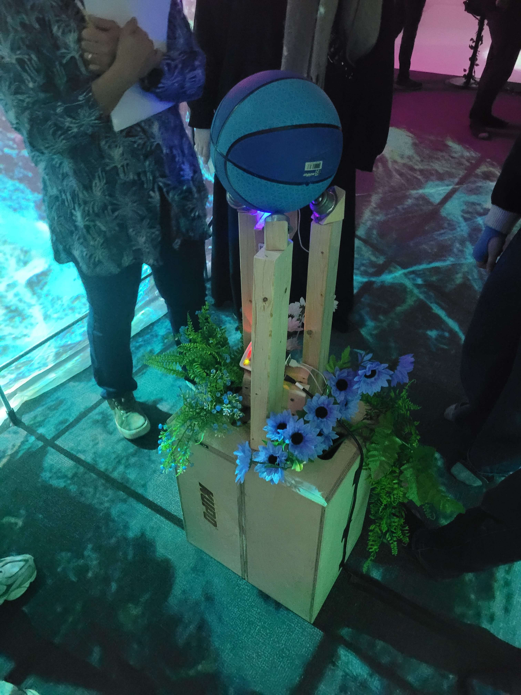
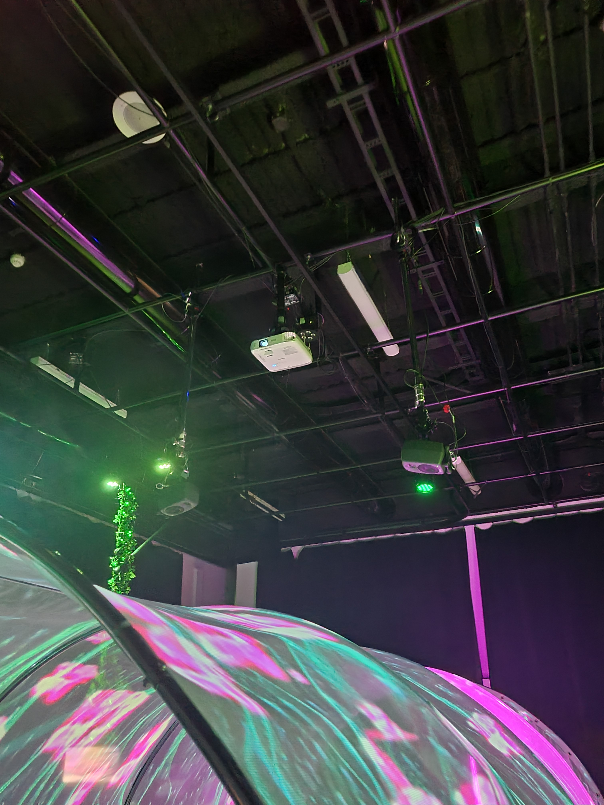
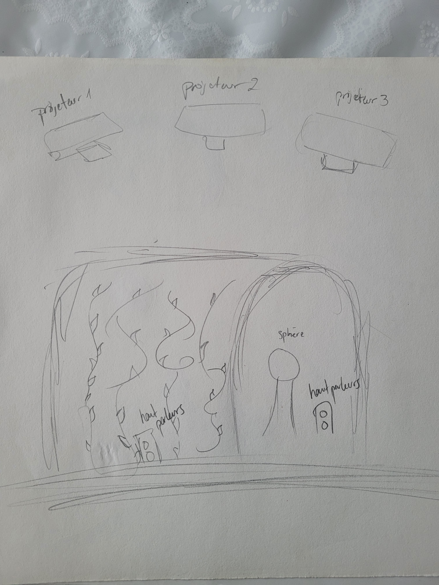

## DISPOSITIF INTERNATURE

Aujourd'hui je vais parler du dispositif que j'ai préféré dans l'exposition des finissants du programme TIM du collège Montmorency. 

Il s'agit d'une exposition d'oeuvres multimédias créées par les étudiants de 3ème année en technique d'intégration mulimédias. Le nom de l'exposition est "Résonance" et elle a été exposée au Collège Montmorency du 17 au 21 Mars. Il s'agit d'une exposition temporaire et intérieure.  

*Voici une photo de l'affiche de l'exposition **Résonance** et une photo de moi devant cette affiche.*

Le dispositif que j'ai préféré et dont je vais parler dans cette fiche se nomme Internature. 

*Voici une photo prise par moi-même de l'ensemble de l'exposition* 

Les étudiants qui ont créé ce dispositif sont les suivant : Khaly Tia Sing, Isaac Fafard, Delphine Grenier, Sitmonternna Yi et Kenza El Harrif et cette oeuvre a été réalisée cette oeuvre en 2025. 

Au sein d'un tunnel immersif, l'utilisateur peut manipuler une sphère permettant de moduler et de contrôler la croissance et la transformation de plantes. L'interaction est axée sur la prise de conscience de l'impact, bien que temporaire, de nos actions sur un écosystème en constante évolution. C'est aussi une référence à la métaphore de Sisyphe et du cycle perpétuel/infini. Cela permet de developper de la sensibilité en observant la corrélation entre l'homme et la nature. (source : https://tprangers.github.io/internature/#/20_intention/10_synopsis/) 

*Voici une photo du cartel expliquant le concept du dispositif **Internature*** 

Il s'agit d'un dispositif immersif, grâce aux sons et aux lumières, et interactive, grâce au fait que l'utilisateur doive faire bouger la sphère pour activer le sons et les images. 

*Voici ici deux photos nous permettant de comprendre le type d'installation d'Internature* 

Le but de ce dispositif est en gros comme dit plus haut de démontrer l'impact que les êtres humains ont sur la nature, même si ces impacts sont temporaires. Le dispositif se trouvent au beau milieu de la pièce. 

Voici un corquis de ce à quoi ressemble l'installation du dispositif dans la pièce. 
Le dispositif est composé de plusieurs éléments indispensables au bon fonctionnement du dispositif : 

1. Un environnement renfermé
2. Une surface propice pour la projection
3. Deux projecteurs
4. Deux haut-parleurs accompagnés d’une carte de son
5. Une sphère
6. Un support de la sphère
7. Un ordinateur

Source : https://tprangers.github.io/internature/#/20_intention/10_synopsis/

*Voici ici des images des projecteurs nécessaires à l'apparition des images contre les parois du tunnel, des capteurs qui détectetent les mouvements de la sphère qui bouge. il s'agit comme les étudiants me l'ont expliqué d'une souris qu'il ont un peu "démembré" si je puis dire.* 

Dès le premier contact, Internature a éveillé ma curiosité grâce à son concept original. La référence à Sisyphe, symbolisant l'effort constant de la création végétale est selon moi extrêmement pertinente. L'installation met en lumière l'impact, même fugace, de nos actions sur l'environnement, tout en soulignant notre capacité à créer temporairement notre monde. J'ai été immédiatement attirée par l'aspect interactif, qui invite à devenir créateur de la transformation d'un genre d'écosystème artificiel. L'ensemble stimule la réflexion sur notre relation à la nature et la place de l'humain. C'est une fusion qui est, selon moi, très réussie de l'art, de la technologie et de la philosophie qui, selon moi, ne peut que susciter l'intérêt et la contemplation.

J'ai vraiment beaucoup aimé l'idée d'aller s'inspirer de la mythologie Grecque pour créer quelque chose de technologique, je trouve que les idées, bien qu'elles soient totalement opposées ont donné un très joli résultat final. 

