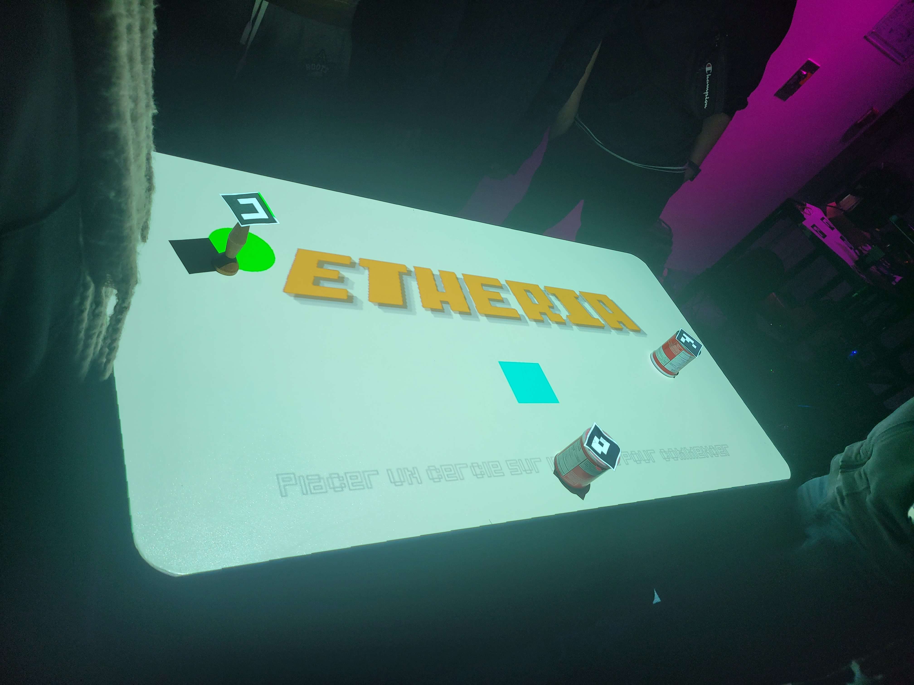
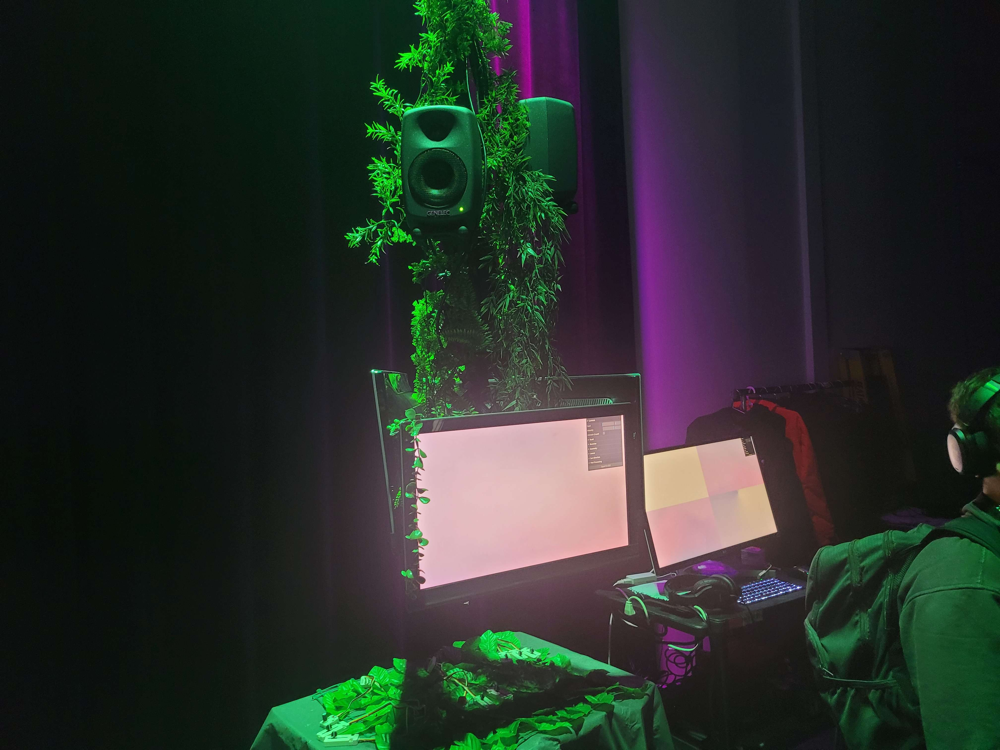
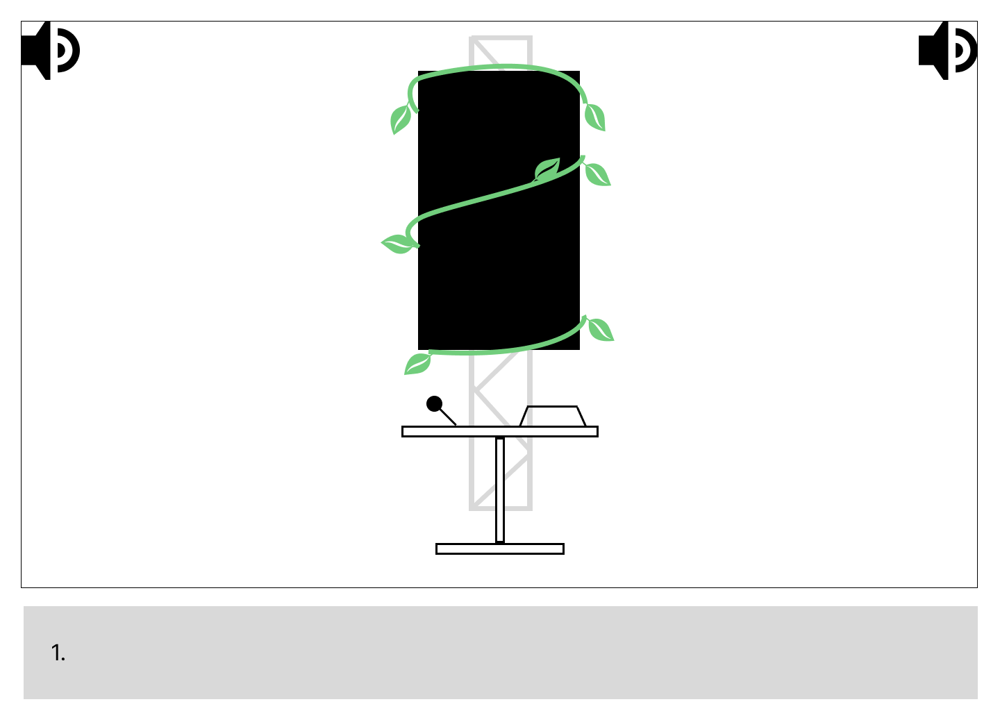
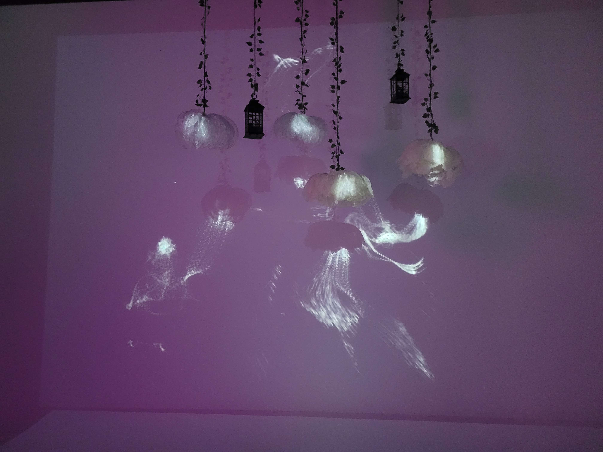
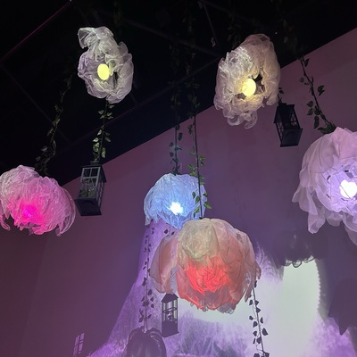

# Liste de tous les projets en ordre de préférence 

Voici tous les projest que les finissant du programme TIM ont préparé, classé en ordre de préférence, de celui que j'ai le moins aimé à mon préféré. 

## 7ème place : Condu8

Le dispositif que j'ai le moins aimé est Condu8. Il a été créé par 5 étudiants : Ian Corbin, Samuel Desmeules Voyer, Alexandre Gervais, Kevin Malric et Jérémy Roy Côté. Il s'agit d'un jeu vidéo où l'utilisateur doit pédaler aussi vite que possible sur un véo stationnaire pour gagner contre des robots programmés pour êtres des adversaires (source : ). Cela motive l'utilisateur à améliorer sa forme physique tout en s'amusant. Voici quelques photos de l'installation. Certaines ont été prises par moi, d'autres ont été prises sur le site officiel du dispositif Condu8 : 

*Photo de la maquette et de l'ordinateur du dispositif **Condu8**. Source : https://gearshift-games.github.io/Web-C0N-DU8/#/40_maquette/*

*Voici ici une image du schéma de plantation imaginé par les étudiants ayant créé **Condu8**. Source : https://gearshift-games.github.io/Web-C0N-DU8/#/30_production/60_plantation/*

Avant de tester le jeu je pensais que ça allait être un jeu relativement simple, un peu comme le jeu vidéo "Mario Kart" où on doit gagner contre des robots. Je ne croyais pas que la vitesse à laquelle l'utilisateur pédalait allait avoir une incidence significative sur la perfromance du joueur. Après l'avoir testé j'ai été surprise par la quantité d'énergie utilisée dans le jeu, je ne m'y attendais pas. Le concept du jeu est intéressant puisque ça sert justement à faire en sorte que les utilisateurs fassent de l'exercices tout en s'amusant ce qui est une idée très créative selon moi. Ceci dit, malgré ça, c'est le projet que j'ai le moins aimé tout simplement parce qu'il s'agit de quelque chose d'assez physique et que ce n'est pas mon genre de jeu préféré si je dois être tout à fait honnête. Je trouve qu'il y a beaucoup d'effort à faire pour réussir à battre les robots du jeu. 

**Mon ressentiment ?**

Je pense que pour avoir réussi à créer un jeu comme celui-ci il faut posséder des connaissances approfondîes en animation 3D, en programmation web et en audio. En 3D pour avoir réussi à créer un environnement et des personnages 3D réussis. En programmation pour être parvenu à faire en sorte que le jeu soit intéractif pour l'utilisateur. Et en audio pour avoir réussi à créer des sons permettant à l'utilisateur d'être encore plus immergé dans l'expérience. Par exemple, les étudiants m'ont parlé du fait qu'ils avaient utilisé un logiciel nommé TouchDesigner qui a permis de faire en sorte que les mouvement du vélo soit en quelques sortes connecté au jeu video et fasse en sorte que lorsque le joueur pédale plus vite, le vélo va plus vite. 

## 6ème place : Arcadia

Le deuxième dispositif dont je vais parler est celui nommé Arcadia. Il a été fabriqué par trois étudiants : Dominique Yale, William Beauvais et Aton Nikulin. Arcadia est un petit jeu d'arcade intéractif. Un roi qui s'est fait attaqué par de vilaines créatures décide d'envoyer son chevalier aller découvrir d'où viennent les créatures. Le concept de ce dispositif est de recréer une expérience d'arcade en recréeant les styles des arcades de l'époque : par exemple les graphismes pixelisés du jeu qui font penser au style vintage des anciennes arcades. (source : https://cousi-cousa.github.io/Arcadia/#/20_intention/10_synopsis/) Voici quelques photos que j'ai prise de la maquette de l'installation d'Arcadia.

*Ceci sont des images du fichier illustrator qui a servi à la création du jeu **Arcadia** et de quelqu'un qui est en train de tester le jeu.*

*Voici une photo du schéma de plantation du projet **Arcadia**. source : https://cousi-cousa.github.io/Arcadia/#/30_production/60_plantation/*

Lorsque j'ai observé le jeu pour la première fois, je l'ai trouvé assez attrayant visuellement, j'ai tout de suite beaucoup apprécié le style pixelisé des images, ça m'a fait pensé à d'anciens jeu vidéo comme Zelda et Mario. Lorsque j'ai joué, c'était très drôle, divertissant et le tout fonctionnait de maniere très fluide.  C'était très agréable à tester. 

**Mon ressentiment ?**

J'ai mis ce dispositif en 6ème place parce que je trouve que ce n'est pas quelque chose de spécialement créatif, c'est un peu quelque chose de vu et revu. Le concept est intéressant, et j'ai beaucoup aimé tester le jeu, mais je trouve que c'ee2tait assez basique comme projet. C'était tout de même très intéressant ! 

## 5ème place : Etheria 

Le troisième dispositif est Etheria. Un peu comme Arcadia il s'agit d'un petit jeu vidéo de défense. On incarne des personnages qui doivent défendre un diamant, ils peuvent avoir des "power-ups" pour obtenir plus de pouvoir pour parvenir à éliminer les ennemis plus facilement et rapidement. Le jeu est composé de 6 niveaux et à chaque fois, il devient de plus en plus compliqué de réussir à éliminer tous les monstres s'attaquant au cristal. Pour jouer au jeu il faut utiliser des pions qui ont été créés grâce à un imprimante 3D. Les images sont projetées sur une table grâce à des projecteurs suspendus en hauteur et il y a également du son qui sort de haut-parleurs. 

*Voici une photo du dispositif **Etheria** et une photo du schéma de plantation du dispositif Etheria. Source : https://ethereal-creators.github.io/Etheria/#/30_production/60_plantation/*

À première vue, tout comme Arcadia le jeu m'a semblé attrayant parce que comme dit plus haut, j'aime beaucoup les jeux qui ont le style de pixel art. Ça m'a donc donné l'envie de tester, et je dois avouer que l'idée de contrôler les personnages grâce à des pions m'a semblé très créative, j'ai trouvé que ça changeait des "joysticks" habituels, ou alors des jeux sur ordinateurs. Ceci dit, tout comme Arcadia, je dois avouer que le concept du jeu reste un peu le même, c'est un peu vu et revu encore une fois. Ce type de jeu où il faut défendre son territoire est assez commun dans le domaine du jeu vidéo. 

**Mon ressentiment ?**

J'ai mis ce dispositif en 5ème place parce que je l'ai trouvé assez créatif dans la manière d'y jouer, mais en même temps je trouve que le concept du jeu de défense n'est pas spécialement créatif. J'ai tout de même apprécié y jouer !

## 4ème place : Fuga 

Le 4ème dispositif est Fuga. Le projet a été créé par 5 étudiants : Matis Labelle, Tristan Khadka, Daniel Dezemma, Abdel Ali Djeral et Yazuv-Selim Gucluer. Le concept de ce jeu est en fait une sorte laboratoire spécial où des scientifiques ont créé trois arbres qui grandissent quand ils entendend certains sons. L'utilisateur utilise des manettes pour faire des bruits spéciaux, et ces sons aident les arbres à pousser. Si les sons sont beaux et bien faits, l'arbre devient grand et joli, et plein d'autres plantes poussent autour. Mais si les sons sont mauvais ou trop forts, l'arbre arrête de grandir et tout devient abîmé. Ce dispositif a été fait en javascript, les trois arbres sont en fait trois sites webs. 

*Voici deux images montrant le dispositif **Fuga** prise par moi-même et une image de son schéma de plantation. Source : https://escapism-fuga.github.io/Fuga/#/30_production/60_plantation/*

**Mon ressentiment ?**
Lorsque j'ai vu ce dispositif pour la première fois, ça ne m'a pas paru spécialement attrayant, mais lorsque je l'ai testé j'ai tout de suite beaucoup aimé. J'ai trouvé très intéressant que l'utilisateur puisse faire pousser son arbre et que cela soit directement lié au son que l'utilisateur génère. Le tout était très beau visuellement et interactif ce que j'ai trouvé très amusant à tester. Bien que ce soit un peu limité comme concept, j'ai beaucoup aimé l'essayer. Ceci dit je l'ai mis en 4ème place parce que jai eu d'autres coups de coeur !

## 3ème place : Luminatura 

Le 3ème dispositif dont je vais parler est luminatura. Il s'agit d'un endroit où la nature et la technologie se mélangent. Il y a des fleurs qui brillent, des vignes, et des lanternes qui sont projetés sur les murs et qui rendent l’endroit plus beau et chaleureux. Lorsque l'utilisateur touche une plaque en métal, elle sent que la peau peut conduire l’électricité (un peu comme un fil) et allume les lumières et les sons. 

*Voici deux photos du dispositif **Luminatura**. La première a été prise par moi et la deuxiè1me est originaire du site web. Source : https://miaou-mafia.github.io/projet-luminatura/#/* 

