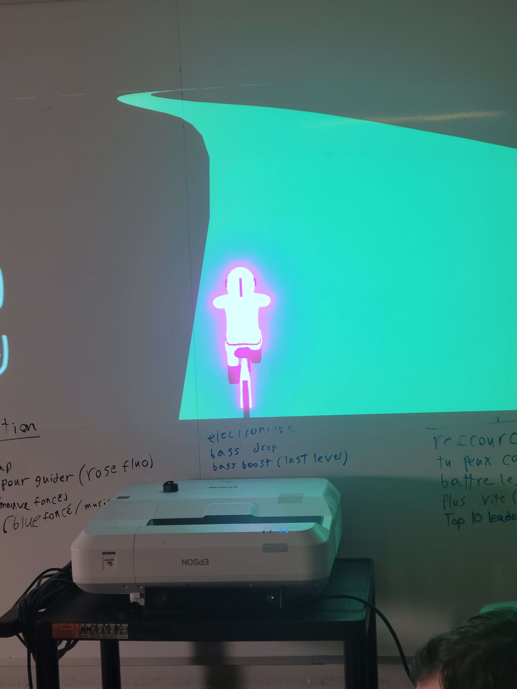
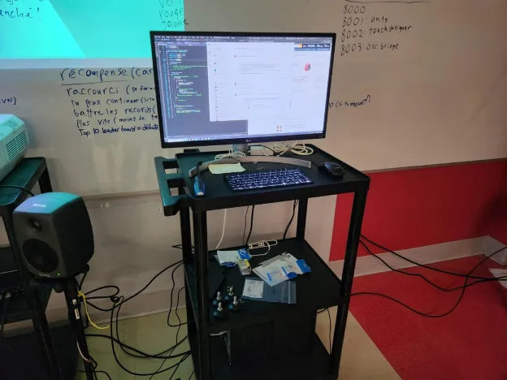

## Liste de tous les projets en ordre de préférence 

Voici tous les projest que les finissant du programme TIM ont préparé, classé en ordre de préférence, de celui que j'ai le moins aimé à mon préféré. 

## 7ème place : Condu8

Le dispositif que j'ai le moins aimé est Condu8. Il a été créé par 5 étudiants : Ian Corbin, Samuel Desmeules Voyer, Alexandre Gervais, Kevin Malric et Jérémy Roy Côté. Voici quelques photos de l'installation. Certaines ont été prises par moi, d'autres ont été prises sur le site officiel du dispositif Condu8 : 

*Photo de la maquette du dispositif **Condu8***

*Photo de l'ordinateur du dispositif **Condu8** source : https://gearshift-games.github.io/Web-C0N-DU8/#/40_maquette/*

Le concept du jeu est intéressant puisque ça sert justement à faire en sorte que les utilisateurs fassent de l'exercices tout en s'amusant ce qui est une idée très créative selon moi. Ceci dit, malgré ça, c'est le projet que j'ai le moins aimé tout simplement parce qu'il s'agit de quelque chose d'assez physique et que ce n'est pas mon genre de jeu préféré si je dois être tout à fait honnête. Je trouve qu'il y a beaucoup d'effort à faire pour réussir à battre les robots du jeu. 

## 6ème place : 
