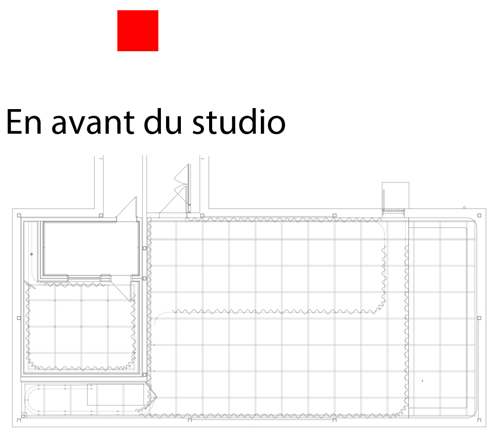

## Liste de tous les projets en ordre de préférence 

Voici tous les projest que les finissant du programme TIM ont préparé, classé en ordre de préférence, de celui que j'ai le moins aimé à mon préféré. 

## 7ème place : Condu8

Le dispositif que j'ai le moins aimé est Condu8. Il a été créé par 5 étudiants : Ian Corbin, Samuel Desmeules Voyer, Alexandre Gervais, Kevin Malric et Jérémy Roy Côté. Il s'agit d'un jeu vidéo où l'utilisateur doit pédaler aussi vite que possible sur un véo stationnaire pour gagner contre des robots programmés pour êtres des adversaires (source : ). Cela motive l'utilisateur à améliorer sa forme physique tout en s'amusant. Voici quelques photos de l'installation. Certaines ont été prises par moi, d'autres ont été prises sur le site officiel du dispositif Condu8 : 

*Photo de la maquette du dispositif **Condu8***

*Photo de l'ordinateur du dispositif **Condu8** source : https://gearshift-games.github.io/Web-C0N-DU8/#/40_maquette/*

*Voici ici une image du schéma de plantation imaginé par les étudiants ayant créé **Condu8**. Source : https://gearshift-games.github.io/Web-C0N-DU8/#/30_production/60_plantation/*

Avant de tester le jeu je pensais que ça allait être un jeu relativement simple, un peu comme le jeu vidéo "Mario Kart" où on doit gagner contre des robots. Je ne croyais pas que la vitesse à laquelle l'utilisateur pédalait allait avoir une incidence significative sur la perfromance du joueur. Après l'avoir testé j'ai été surprise par la quantité d'énergie utilisée dans le jeu, je ne m'y attendais pas. Le concept du jeu est intéressant puisque ça sert justement à faire en sorte que les utilisateurs fassent de l'exercices tout en s'amusant ce qui est une idée très créative selon moi. Ceci dit, malgré ça, c'est le projet que j'ai le moins aimé tout simplement parce qu'il s'agit de quelque chose d'assez physique et que ce n'est pas mon genre de jeu préféré si je dois être tout à fait honnête. Je trouve qu'il y a beaucoup d'effort à faire pour réussir à battre les robots du jeu. 

**Mon ressentiment ?**

Je pense que pour avoir réussi à créer un jeu comme celui-ci il faut posséder des connaissances approfondîes en animation 3D, en programmation web et en audio. En 3D pour avoir réussi à créer un environnement et des personnages 3D réussis. En programmation pour être parvenu à faire en sorte que le jeu soit intéractif pour l'utilisateur. Et en audio pour avoir réussi à créer des sons permettant à l'utilisateur d'être encore plus immergé dans l'expérience. Par exemple, les étudiants m'ont parlé du fait qu'ils avaient utilisé un logiciel nommé TouchDesigner qui a permis de faire en sorte que les mouvement du vélo soit en quelques sortes connecté au jeu video et fasse en sorte que lorsque le joueur pédale plus vite, le vélo va plus vite. 

## 6ème place : Arcadia

Le deuxième dispositif dont je ais parler est celui nommé Arcadia. Il a été fabriqué par trois étudiants : Dominique Yale, William Beauvais et Aton Nikulin. Arcadia est un petit jeu d'arcade intéractif. Un roi qui s'est fait attaqué par de vilaines créatures décide d'envoyer son chevalier aller découvrir d'où viennent les créatures. Le concept de ce dispositif est de recréer une expérience d'arcade en recréeant les styles des arcades de l'époque : par exemple les graphismes pixelisés du jeu qui font penser au style vintage des anciennes arcades. (source : https://cousi-cousa.github.io/Arcadia/#/20_intention/10_synopsis/) Voici quelques photos que j'ai prise de la maquette de l'installation d'Arcadia.

*Ceci est une photo du fichier illustrator qui a servi à la création du jeu **Arcadia***

*Ceci est une image de quelqu'un qui est en train de jouer au jeu*

*Voici une photo du schéma de plantation du projet **Arcadia**. source : https://cousi-cousa.github.io/Arcadia/#/30_production/60_plantation/*

Lorsque j'ai observé le jeu pour la premiè1re fois, je l'ai trouvé assez attrayant visuellement, j'ai tout de suite beaucoup apprécié le style pixelisé des images, ça m'a fait pensé à d'anciens jeu vidéo comme Zelda et Mario. Lorsque j'ai joué, c'était très drôle, divertissant et le tout fonctionnait de maniere très fluide.  C'était très agréable à tester. Je pense que pour réussir à atteindre un résultat comme celui-ci il faut posséder des compétences en animation 2D, en programmation web et en illustration numérique. En illustration numérique pour avoir réussi à créer de jolies images animables, en animation 2D pour avoir réussi à animer les personnages et l'environnement dans lequel ils évoluent et en programmation web pour faire en sorte que le jeu fonctionne bien et que l'expé2rience soit fluide pour l'utilisateur. 

**Mon ressentiment ?**

J'ai mis ce dispositif en 6ème place parce que je trouve que ce n'est pas quelque chose de spécialement créatif, c'est un peu quelque chose de vu et revu. Le concept est intéressant, et j'ai beaucoup aimé tester le jeu, mais je trouve que c'ee2tait assez basique comme projet. C'était tout de même très intéressant ! 

## 5ème place : Etheria 

Le troisième dispositif est Etheria. Un peu comme Arcadia il s'agit d'un petit jeu vidéo de défense. On incarne des personnages qui doivent défendre leur territoires, ils peuvent avoir des "power-ups" pour obtenir plus de pouvoir pour parvenir à éliminer les ennemis plus facilement et rapidement. 
