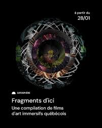

## DISPOSITIF INTERNATURE

Aujourd'hui je vais parler d<une oeuvre que je suis allée visiter à la société des Arts Technologiques du Québec à Montréal. 

Il s'agit de 7 oeuvres Québécoises regroupées sous le thème de "Fragments d'ici" 

*Voici une photo de l'affiche de l'oeuvre des **Fragments d'ici** et une photo de moi devant le b]atiment de la SAT*
