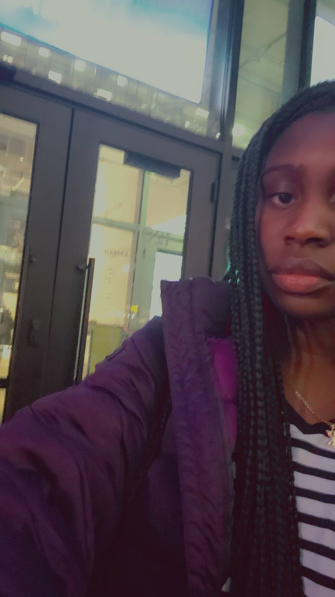
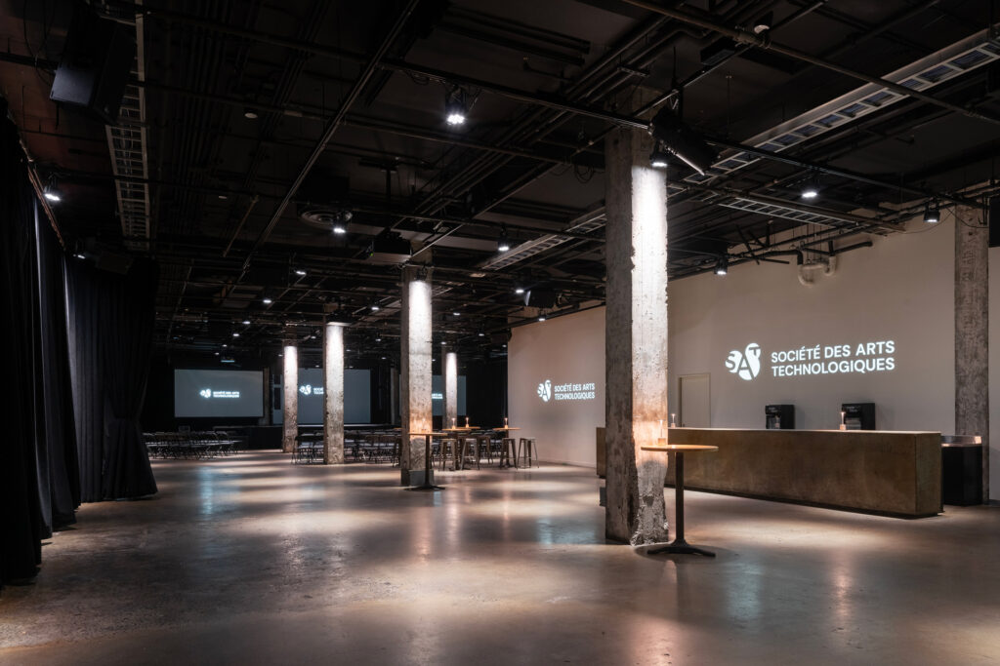
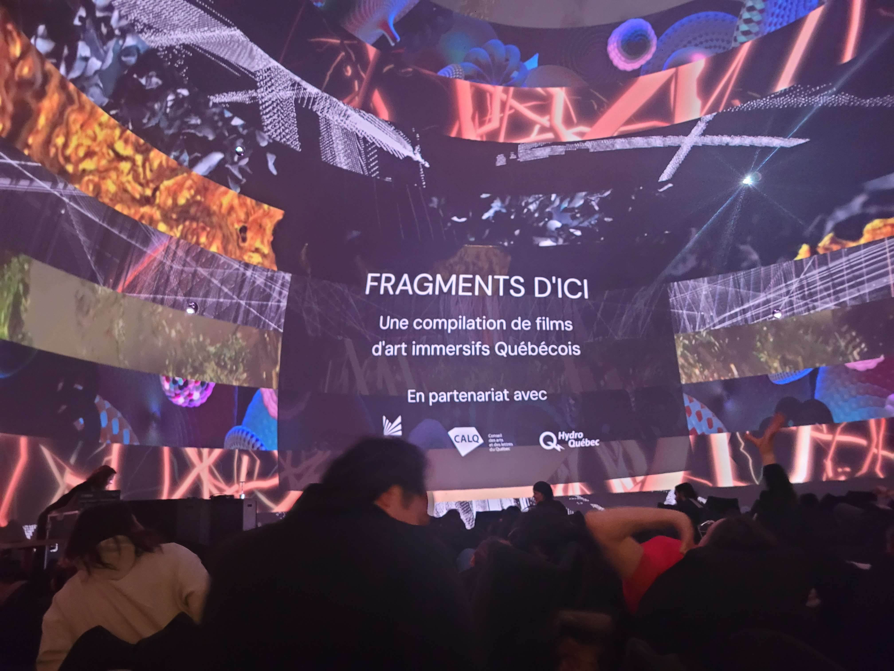
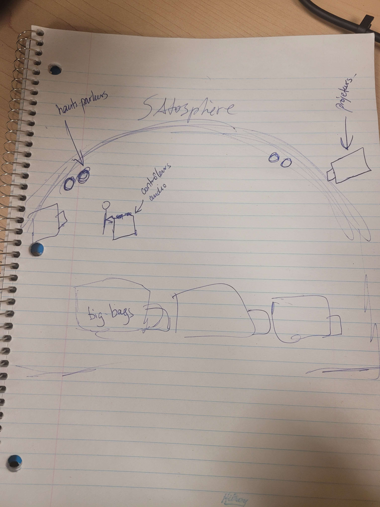
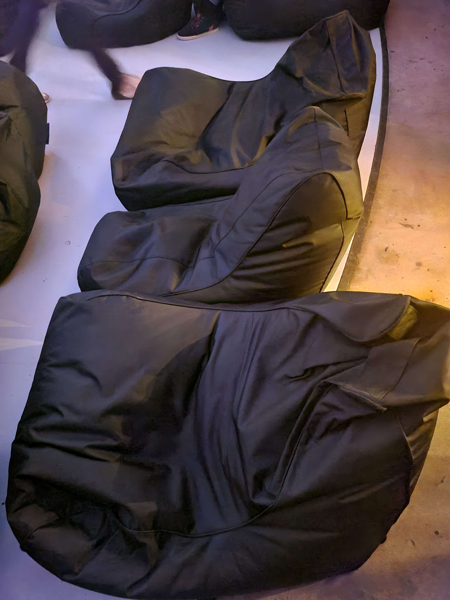
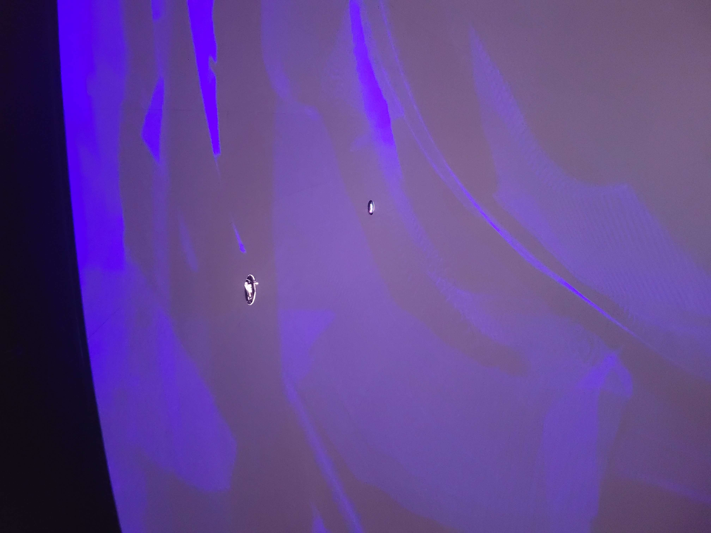

# Les fragments d'ici

#### À la SAT, Fragments d'ici invite les visiteurs à explorer des morceaux de mémoire et de l'identité québécoises à travers une expérience immersive. Présentée dans un espace reliant l'art à la technologie, cette œuvre propose un parcours captivant fait de projections visuelles, de sons enveloppants et d’interactions subtiles. Une immersion qui questionne notre rapport au temps, à l’espace et aux récits qui nous entourent.

 

*Voici une photo de moi devant le bâtiment de la SAT et celle de l'intérieur de la SAT. Sources : https://sat.qc.ca/fr/louer-la-sat/*

## Fragments d'ici : Une exploration immersive dans la Satosphère

Le 25 février 2025, j'ai visité la Satosphère de la Société des Arts Technologiques (SAT) à Montréal, un lieu réputé pour ses expériences immersives et innovantes. Mon choix s’est porté sur Fragments d’ici, une œuvre collaborative réalisée par Lydia Yakonowsky, Allison Moore, Jules Roze, Pablo Geeraert, Nora Gibson, Line Katcho, Guillaume Bourrassa, et Meisam Nemati/Sulfation. Cette projection immersive marie un univers visuel captivant à une ambiance sonore enveloppante, créant une expérience artistique unique.

## Description de l’œuvre

Fragments d’ici est une collection d’œuvres immersives projetées à 360 degrés sur le dôme de la Satosphère, un espace de 18 mètres de diamètre et de 11,5 mètres de hauteur. Grâce à huit projecteurs vidéo et un système de 90 haut-parleurs, ces œuvres plongent les spectateurs dans un environnement sonore et visuel enveloppant.

*voici une image du croquis que j'ai dessiné de la pièces*

Les spectateurs assistent à ces projections en position allongée sur des big-bags, leur regard dirigé vers le dôme. Cette posture favorise une immersion totale, transformant le dôme en une sorte de fenêtre ouverte sur un univers onirique. J'utilise le mot onirique parce que les œuvres ne racontent pas d’histoires vraiment claires, mais explorent des thématiques comme les trajectoires, les lignes de fuite, la temporalité, la fluidité et d’autres concepts abstraits. Ces idées sont véhiculées à travers des mouvements fluides, des couleurs vibrantes et une multitude de pixels qui dansent et se transforment, créant un univers d’une richesse visuelle saisissante.

 

*voici des photos des big-bags sur lesquels les visiteurs sont allongés et des projecteurs de la salle*

## Mon expérience personnelle

Dès les premières secondes, j’ai été frappée par la qualité des images et des sons, qui semblaient se répondre en parfaite harmonie. La position allongée renforce l’immersion, donnant l’impression d’être aspiré dans un autre monde. L’atmosphère était à la fois apaisante et stimulante, me poussant à réfléchir tout en savourant la beauté de l’instant. J’ai ressenti un profond sentiment de déconnexion avec la réalité autour de moi. L'immense dôme m’a immédiatement enveloppée, et les images évocatrices, combinées aux sons parfaitement synchronisés, m’ont transportée dans un état de contemplation presque méditative. L’absence de narration claire a laissé libre cours à mon imagination, chaque spectateur pouvant interpréter les formes et les couleurs à sa manière. L’ambiance était apaisante, presque hypnotique, tout en étant stimulante sur le plan intellectuel et émotionnel.

## Appréciation critique

Les points forts de Fragments d’ici sont nombreux. Tout d’abord, l’exécution technique est admirable selon moi : la qualité des projections et la spatialisation sonore sont remarquables, créant une immersion totale. L’esthétique visuelle, avec ses couleurs intenses et ses mouvements fluides, est également un atout majeur. Enfin, la diversité des thématiques abordées offre une expérience riche et variée, chaque œuvre apportant son propre univers.

Cependant, l’agencement des spectateurs dans l’espace pourrait être amélioré. Bien que les big-bags soient confortables, ils sont placés assez proches les uns des autres, ce qui peut légèrement perturber l’intimité de l’expérience. J’ajouterais également  un accompagnement avant chaque projection pour mieux introduire les spectateurs à la nature abstraite des œuvres, facilitant ainsi leur compréhension et leur appréciation.

## Références et comparaisons

Cette expérience immersive m’a rappelé Ravel Ravel Interval d’Anri Sala, vue au Musée des beaux-arts de Montréal. Dans les deux cas, le son et l’image travaillent en symbiose pour créer une immersion sensorielle intense. Toutefois, là où Ravel Ravel Interval joue sur la précision musicale et la répétition, Fragments d’ici explore un territoire plus onirique et abstrait, laissant davantage de place à l’interprétation individuelle. La spatialisation sonore et l’échelle monumentale du dôme renforcent l’impact émotionnel de l’expérience, rendant Fragments d’ici unique dans son approche.

## Conclusion

Fragments d’ici est une œuvre immersive qui démontre la puissance de l’art numérique à éveiller les sens et à stimuler l’imagination. Bien qu’il y ait des ajustements possibles pour améliorer l’expérience, notamment au niveau de l’agencement spatial, cette installation reste une réussite à bien des égards. Elle m’a inspirée à repenser la manière dont le son et l’image peuvent être utilisés pour créer une immersion totale dans un univers artistique. Cette visite a renforcé mon intérêt pour les installations multimédias et m’a donné envie d’explorer davantage ce type de création dans mes projets futurs.
