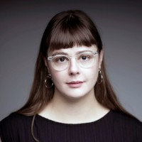
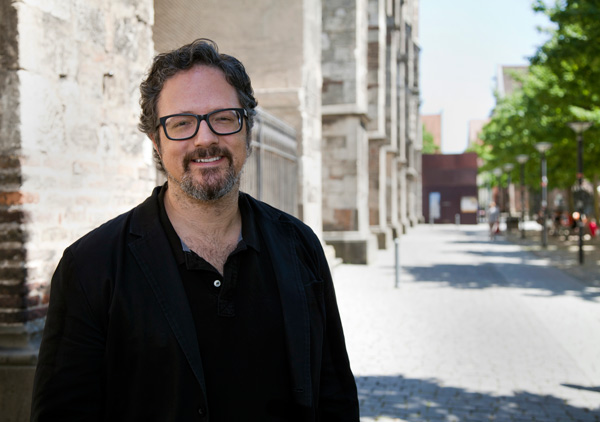

Nous avons assisté à une conférence de Jade Séguela. 

### Qui est Jade Séguela ?

Il s'agit d'une artiste montréalaise qui travaille dans le milieu de l'art numérique. Elle a fait une maîtrise en muséologie a l'Université du Québec à Montréal et elle travaille pour l'artiste Rafael Lozano-Hemmer. 

 

*Voici une image de l'artiste Rafael Lozano-Hemmer. Source : https://ca.linkedin.com/in/jade-s%C3%A9gu%C3%A9la-23185213b*

### Qui est Rafael Lozano-Hemmer ?

Rafael Lozano-Hemmer est un artiste mexicain-canadien né à Mexico en 1967. Il a étudié la chimie physique à l'Université Concordia à Montréal, où il a obtenu un baccalauréat en sciences. 

*Voici une image de l'artiste Rafael Lozano-Hemmer. Source : https://en.wikipedia.org/wiki/Rafael_Lozano-Hemmer*

### De quoi parlait cette conférence ?

Lors de la conférence, elle nous a expliqué le processus complexe et collaboratif derrière la création et l'exposition d'œuvres interactives, mais elle nous a également montré trois de ces oeuvres : Cloud Display (on dit un mot et il s'affiche en fumée), Binosular Tension (des yeux suivent les utilisateurs du regard) et Shadow Tuner (Un globe etrrestre géant reflétant les ombres de ceux qui passent devant).

La conférence montre l'importance de la collaboration avec des chercheurs et des techniciens tout en montrant le résultat de chacune de ces contributions au processus de production, de conservation et d'exposition des œuvres. Madame Séguela parle aussi du fait que l'interactivité des œuvres peut être activé par des technologies comme les caméras, capteurs et microphones, ce qui crée des œuvres à la fois passives et actives. Un exemple marquant est le projet du Shadow Tuner à Dubai, où l'artiste voulait permettre aux spectateurs de reproduire leurs ombres.

*Voici une photo du projet de "poulet rôti" géant, le Shadow Tuner, dans le désert de Dubai. Source : https://www.lozano-hemmer.com/projects.php*

La conférence montre l'importance de la collaboration technique et logistique dans la réalisation d'œuvres d'art modernes, où chaque détail, du câblage aux projections, participe à l'expérience du public.

J'ai bien apprécié cette conférence, surtout la partie où l'intervenante parlait des projets réalisés. La partie où elle parlait de muséologie était selon moi, moins intéressante mais tout de même j'ai beaucoup apprécié l’écouter !

