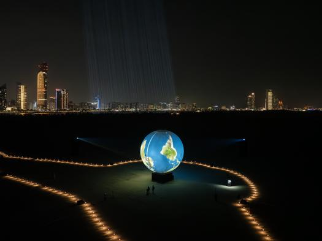

Nous avons assisté à une conférence de Jade Séguela, une artiste montréalaise qui travaille dans le milieu de l'art numérique. Elle a fait une maîtrise en muséologie a l'Université du Québec à Montréal et elle travaille en tant que régisseuse pour l'artiste Rafael Lozano-Hemmer. Lors de la conférence, elle nous a expliqué le processus complexe et collaboratif derrière la création et l'exposition d'œuvres interactives, mais elle nous a également montré deux de ces oeuvres.

L'artiste, créant des œuvres qui semblent solitaires, repose sur une équipe multidisciplinaire. La conférence montre l'importance de la collaboration avec des chercheurs et des techniciens tout en montrant le résultat de chacune de ces contributions au processus de production, de conservation et d'exposition des œuvres. Madame Séguela insiste particulièrement sur le rôle des artistes dans la création des oeuvres. Elle parle aussi du fait que l'interactivité des œuvres peut être activé par des technologies comme les caméras, capteurs et microphones, ce qui crée des œuvres à la fois passives et actives. Un exemple est loeuvre nommé Binocular Tension qui consiste simplement à suivre les utilisateur des yeux. Il s'agit d'une oeuvre passive.  

Un autre exemple exemple marquant selon moi est le projet du "poulet rôti" géant (le Shadow Tuner) à Dubai, où l'artiste voulait permettre aux spectateurs de reproduire leurs ombres.

*Voici deux photos du projet de "poulet rôti" géant, le Shadow Tuner, à Dubai. Source : https://www.lozano-hemmer.com/projects.php*

Ce projet nécessitait des technologies complexes et un travail de collaboration avec des entreprises spécialisées, tout en faisant face à des défis comme les conditions climatique et l'ampleur de l'installation. Jade Séguela décrit les étapes de ce projet, de la construction du ballon de 25 mètres à l'optimisation des projections sur la sphère géante, en passant par la gestion de l'interaction avec les spectateurs. La conférence montre l'importance de la collaboration technique et logistique dans la réalisation d'œuvres d'art modernes, où chaque détail, du câblage aux projections, participe à l'expérience du public.

J'ai bien apprécié cette conférence, surtout la partie où l'intervenante parlait des projets réalisés. La partie où elle parlait de muséologie était selon moi, moins intéressante mais tout de même j'ai beaucoup apprécié l’écouter !

